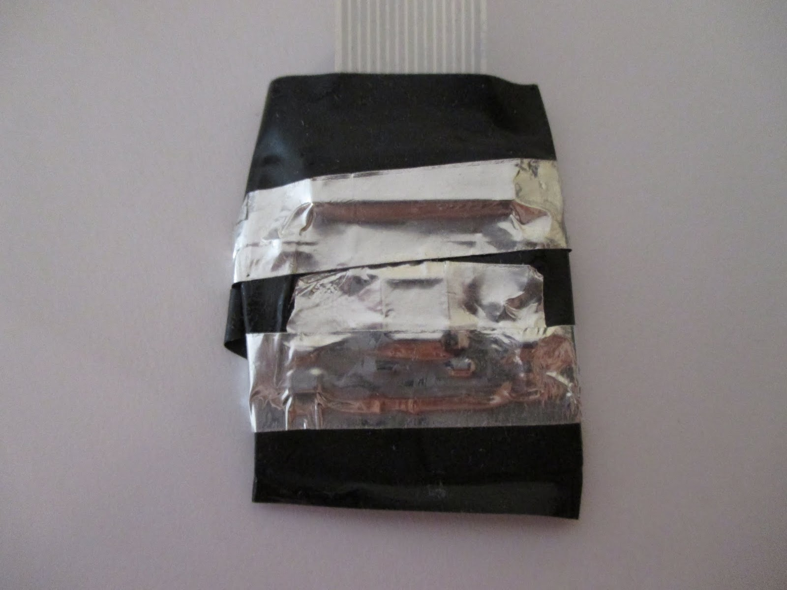
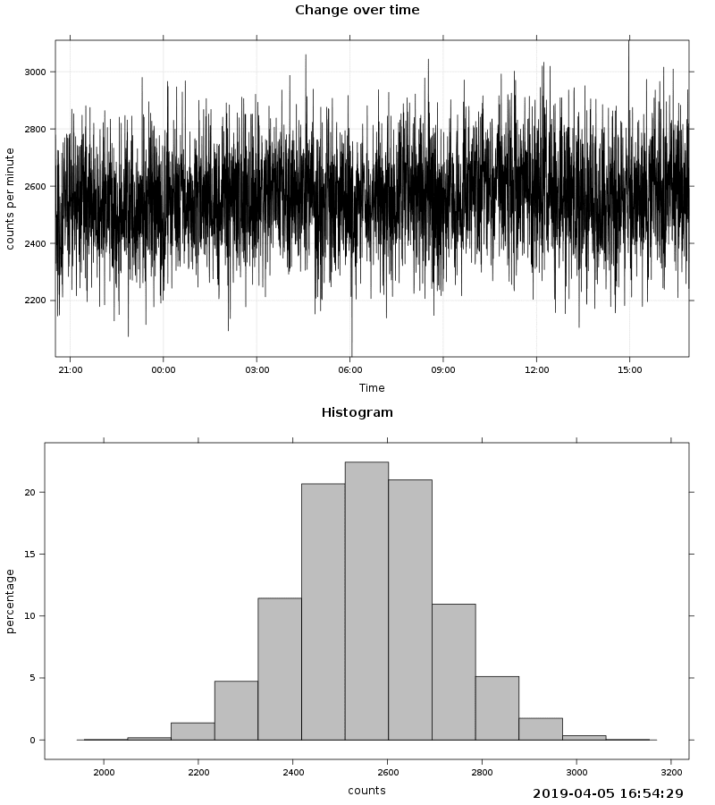

# CameraRadioactivityDetector

**This project currently doesn't work**

## Abstract

The camera sensor is sensitive to light, but it should be also probably sensitive to gamma rays, or maybe other radioactivity type. This should be similar in work to [semiconductor radioactivity detector based on a discrete photodiodes](https://github.com/RobertGawron/SemiconductorRadioactivityDetector).

## Hardware

To make it works, the sensor must be shielded from light - levels of light are much higher than radioactivity levels, so it would dominate results making them useless. For this purpose, whole camera was covered in black duck tape. To avoid EMI interference, the camera was additionally shielded with aluminum adhesive tape (although not grounded). To increase sensitivity, optic of camera was removed (any obstacle absorb to someone extends.

As the sensor was used a cheap camera for RaspbberyPI, the whole device is visible below.

## Software

To handle the camera on the software side, Python script (with PiCamera library) was used. Software part is constantly reading data from the camera (as pictures) and calculate the total sum of all pixels. In case of observed radioactivity event, the sum should increase. The mentioned script creates, csv file that alters analyzed using R script to plot measured value in function of time and the histogram of measured values.

## Measurements

Without any sample, internal noise of the sensor (and maybe background radiation) should give after some time (e.g. after a couple of hours) a Gaussian curve on the histogram. After putting measures sample to the sensor and waiting similar period, a new Gaussian curve would appear, so that the histogram would have to visible peaks. That was an original project's assumption, however, as visible below it doesn't work this way - there is only one peek.

The results are visible on below graph.

## More info

[This project was originally described on my blog](https://robertgawron.blogspot.com/2019/05/camera-nuclear-radiation-sensor-part-i.html), this repo was created to collect used scripts and measured data.